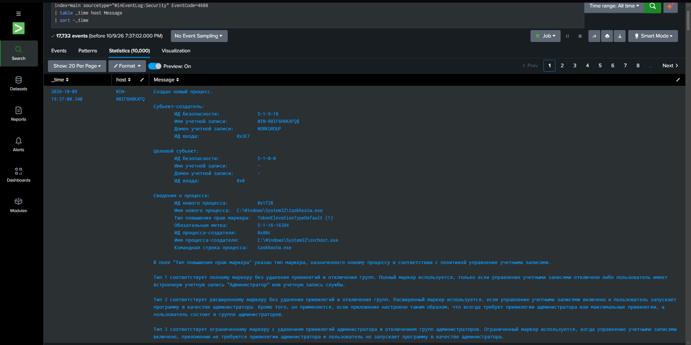
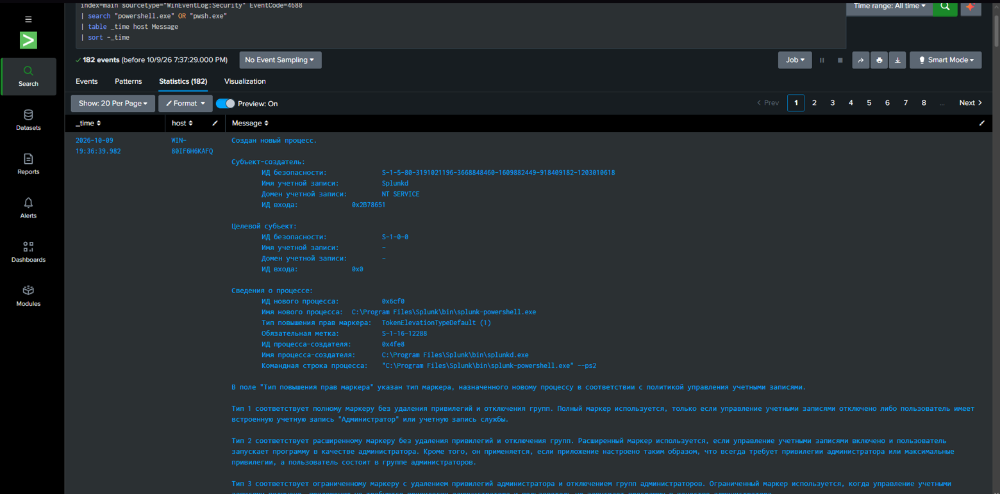
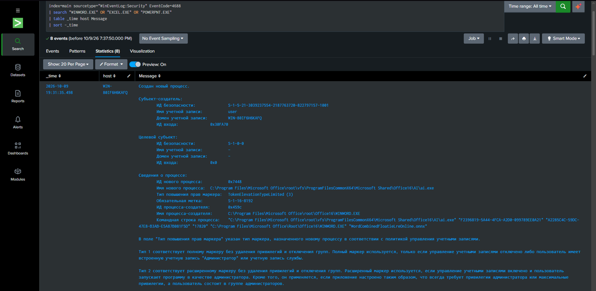
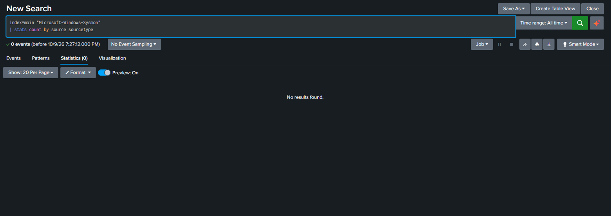
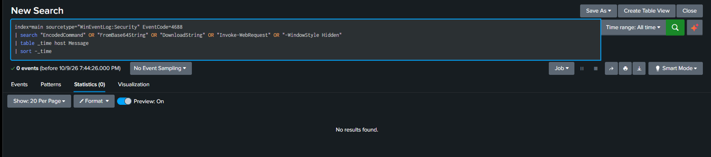
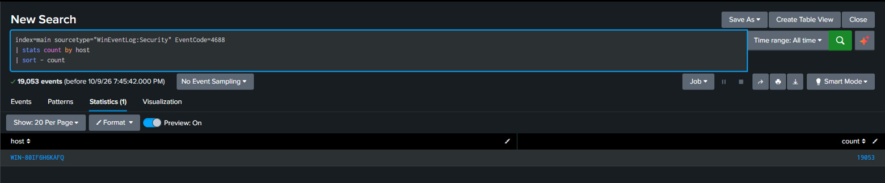
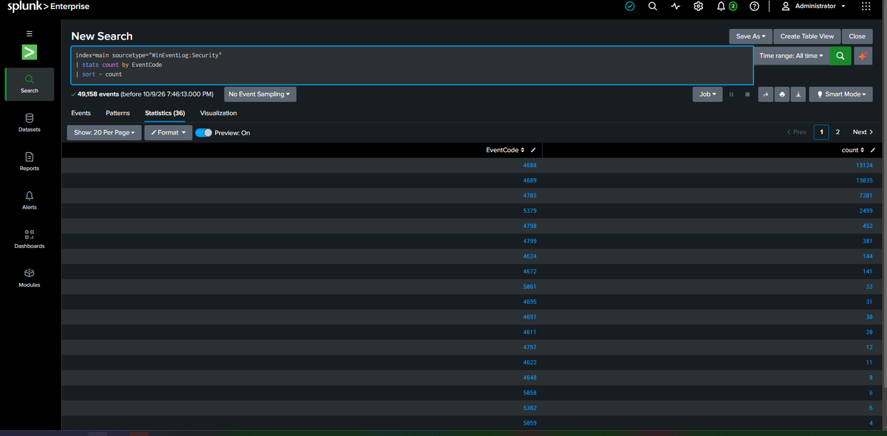
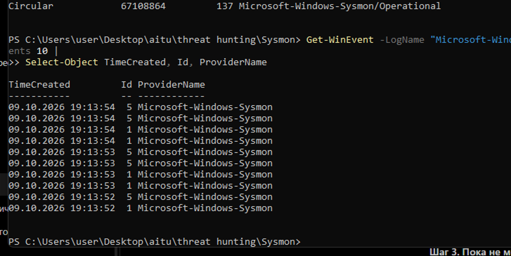
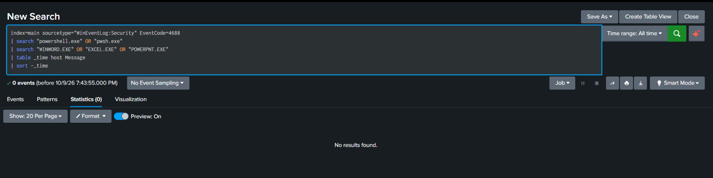

# Threat Hunting Concept and Scenario Analysis

**Project:** Analysis of SIEM Priority Evasion Techniques and Development of Threat Hunting Scenarios for Low-Severity Threats

## 1. Introduction

Threat Hunting Concept and Scenario Analysis

Project: Analysis of SIEM Priority Evasion Techniques and Development of Threat Hunting Scenarios for Low-Severity Threats


## 1. Introduction

Threat hunting is a proactive investigation that searches for malicious activity that existing security controls may have missed. A hunt begins with a question, examines relevant evidence, and produces findings or improvements to detection coverage. SANS emphasizes testable hypotheses, suitable telemetry, and a repeatable investigation process

For this assignment, we create a hypothesis-driven hunting scenario and analyse it, along with executing hunt queries in Splunk or ELK.

This hypothesis-driven PowerShell hunting scenario supports the project by correlating seemingly low-severity events to uncover malicious activity that SIEM prioritization may overlook, helping evaluate priority evasion techniques and develop effective threat hunting scenarios.


#### 2. Hunting models

| Model | Starting point | Example |
| --- | --- | --- |
| Intel-driven | Threat intelligence about attackers, indicators of compromise (IOCs), or tactics, techniques, and procedures (TTPs). | A report describes a campaign using PowerShell to download payloads. Hunters search for its indicators and behavior. |
| Hypothesis-driven | A testable assumption about attacker behavior in the organization’s environment. | “Attackers may be using Office documents to launch PowerShell and retrieve malicious code.” Hunters investigate whether this behavior occurred. |

These approaches can overlap: threat intelligence can inform a hypothesis. SANS summit material describes structured hunts that begin with hypotheses and may be triggered by intelligence reports or attacker activity.


#### 3. Hypothesis-driven scenario: suspicious PowerShell activity

Scenario: A fictional organization uses Windows workstations and Microsoft Office. PowerShell is permitted for administration, but ordinary employees rarely use it. The security team wants to investigate possible malicious script execution without waiting for an alert.

Hypothesis:
“During the last seven days, at least one employee workstation executed unauthorized PowerShell launched by an Office application, which then retrieved and executed code from an external location.”

Scope: Employee Windows workstations, the last seven days, and available historical data for comparison.

Objective: Identify the execution chain, establish whether it was authorized, and determine which devices and accounts were affected.

ATT&CK mapping: PowerShell execution maps to T1059.001 — Command and Scripting Interpreter: PowerShell. Other techniques should be assigned only when supporting evidence is found.


#### 4. Required evidence

| Data source | Evidence to examine |
| --- | --- |
| EDR process telemetry or Sysmon Event ID 1 | PowerShell command line, parent process, account, process identifiers, and execution time. |
| Windows PowerShell Event ID 4104 | Script-block content, where Script Block Logging was enabled. |
| EDR network telemetry or Sysmon Event ID 3 | Connections attributable to the suspicious process; Sysmon network logging must be enabled. |
| DNS, proxy, and firewall logs | Contacted domains, destinations, and connection times. |
| Email and endpoint file records | Possible delivery document, downloaded files, and subsequent execution. |

Microsoft documents Sysmon’s process and network telemetry and Windows PowerShell’s Event ID 4104 logging. Logging coverage must be checked before interpreting missing events.


#### 5. Investigation procedure

Check visibility and establish a baseline. Confirm that relevant devices reported logs throughout the hunt period. Identify approved scripts, administrative accounts, and normal PowerShell usage.

Find candidate executions. Search for powershell.exe and pwsh.exe launched by Word, Excel, or PowerPoint. Also examine intermediary processes, such as Office launching cmd.exe, which then launches PowerShell.

Inspect commands and scripts. Look for encoded commands, hidden execution, obfuscation, remote downloads, and downloaded-code execution. Decode captured content for inspection without executing it. These features are investigation leads; individual flags do not prove malicious activity.

Correlate the evidence. Connect process execution, script content, network connections, and file activity into a timeline. Use process identifiers that distinguish separate executions, rather than relying on timestamps alone.

Check legitimate explanations. Verify whether the activity belongs to an approved macro, business workflow, deployment tool, or administrator. Compare the script, destination, account, and timing with the approved activity.

Expand and document the hunt. Search other devices for the same script content, execution pattern, destination, or file hash. Record findings, evidence, affected assets, and visibility gaps.


## 6. Practical SIEM Hunting in Splunk

The practical part uses the Windows Security events available in the local Splunk instance. The original queries assumed Sysmon process and network fields, but those events were not yet available in the searched Splunk index. Therefore, the queries below were adapted to the data that could actually be searched. The results show process activity; they do not by themselves prove malicious activity.


### 6.1. Search for process creation events

Windows Security Event ID 4688 records process creation. The following query searches the main index for these events and displays the time, host, event code, and message.

```spl
index=main sourcetype="WinEventLog:Security" EventCode=4688
 | table _time host EventCode Message
 | sort -_time
```

The search returned process-creation events. One visible event showed the process C:\Program Files\Splunk\bin\splunk-powershell.exe, launched by splunkd.exe. This is consistent with Splunk's own operation and must not be reported as an attack.



*Figure 1. Windows Security Event ID 4688 results containing a Splunk PowerShell process.*


### 6.2. Search for PowerShell-related process events

The next query narrows the Event ID 4688 results to messages containing PowerShell. This is a broad search for investigation leads, not a malware detector.

```spl
index=main sourcetype="WinEventLog:Security" EventCode=4688
 | search "powershell.exe" OR "pwsh.exe"
 | table _time host Message
 | sort -_time
```

The search returned PowerShell-related events, including splunk-powershell.exe. Because this is a Splunk component, the result is a useful example of why process names need context: a match is not automatically suspicious. The command line, parent process, user, and purpose must be reviewed.



*Figure 2. PowerShell-related process events returned by Splunk.*


### 6.3. Search for Office-related process events

The following query searches process-creation events for Microsoft Office applications. This checks whether Office-related process activity is present in the available Security logs.

```spl
index=main sourcetype="WinEventLog:Security" EventCode=4688
 | search "WINWORD.EXE" OR "EXCEL.EXE" OR "POWERPNT.EXE"
 | table _time host Message
 | sort -_time
```

The query returned four events in the observed search. One event showed an Office-related process record. This does not prove that Office launched PowerShell; it only confirms that matching Office process activity exists in the searched data. Parent-child process fields or Sysmon Event ID 1 would be needed to verify the execution chain.



*Figure 3. Office-related process-creation events returned by Splunk.*


### 6.4. Search for suspicious PowerShell command patterns

A further query attempted to find command-line indicators such as EncodedCommand, DownloadString, Invoke-WebRequest, FromBase64String, and hidden-window options. In the available indexed events, this search returned zero events. This means no matching event was found in the selected index and time range; it does not prove that the activity never happened.

```spl
index=main sourcetype="WinEventLog:Security" EventCode=4688
 | search "EncodedCommand" OR "-enc" OR "DownloadString" OR "Invoke-WebRequest" OR "FromBase64String" OR "WindowStyle Hidden"
 | table _time host Message
 | sort -_time
```



*Figure 4. The suspicious-command search returned zero events in the searched data.*


### 6.5. Testing a Combined Office and PowerShell Search

A stricter search was used to check whether the same Security event message contained both PowerShell-related text and an Office application name. It returned zero events. This is not proof that the behavior never happened. Windows Security Event ID 4688 messages may not contain all fields needed for reliable parent-child correlation, and the search terms may not occur together in one message. The result shows a limitation of this query and the currently indexed data.

```spl
index=main sourcetype="WinEventLog:Security" EventCode=4688
 | search "powershell.exe" OR "pwsh.exe"
 | search "WINWORD.EXE" OR "EXCEL.EXE" OR "POWERPNT.EXE"
 | table _time host Message
 | sort -_time
```



*Figure 7. The combined Office and PowerShell search returned zero events.*


### 6.6. Establishing a Baseline by Host

To establish a simple baseline, the process-creation events were grouped by host. The captured search returned 19,053 Event ID 4688 records for one Windows host. This count describes the events present in the selected index and time range; it is not a count of attacks. The number may change as new logs arrive or the search is run again.

```spl
index=main sourcetype="WinEventLog:Security" EventCode=4688
 | stats count by host
 | sort - count
```



*Figure 8. Process-creation events grouped by host in Splunk.*


### 6.7. Reviewing the Event Code Distribution

The next query counted Security events by EventCode. The screenshot shows 49,158 events in the search and 36 event-code groups. The largest visible groups include Event ID 4688 (process creation), Event ID 4689 (process termination), and Event ID 4703 (token privilege adjustment). This overview helps identify which telemetry is available before choosing more focused hunt queries. Event volume alone does not establish severity or maliciousness.

```spl
index=main sourcetype="WinEventLog:Security"
 | stats count by EventCode
 | sort - count
```



*Figure 9. Security events grouped by EventCode; counts reflect this captured search.*

The combined query and baseline searches are included as practical evidence of the hunt process. Some searches returned zero results, while broader searches returned records. These outcomes are documented as observed; they are not presented as proof that an attack occurred or that a SIEM priority rule was bypassed.


## 7. Checking Sysmon Telemetry

Sysmon was installed and its local Operational log was checked directly in Windows PowerShell. The log existed and contained 137 records at the time of checking. The last ten records included Event ID 1 (Process Create) and Event ID 5 (Process Terminate). This confirms that Sysmon was recording local events, but it does not mean that the events had already been ingested into Splunk.

```spl
Get-WinEvent -LogName "Microsoft-Windows-Sysmon/Operational" -MaxEvents 10 | Select-Object TimeCreated, Id, ProviderName
```



*Figure 5. Local Sysmon Operational log showing Event ID 1 and Event ID 5 records.*

A search for the Sysmon log name in index=main returned zero events. This indicates that the local Sysmon log was not available through that Splunk search at the time of testing. The next step is to configure Splunk to collect the Microsoft-Windows-Sysmon/Operational channel and then verify the incoming source and sourcetype.



*Figure 6. Splunk search for the Sysmon log name returned zero events.*


## 8. Correlation and Interpretation

The intended hunt is to connect an Office process, PowerShell execution, and possible external network activity. The available Windows Security events allow searches for process creation and PowerShell-related text, but the current results do not establish that Office launched PowerShell or that PowerShell contacted an external destination. A process name match alone is insufficient.

To complete the correlation, Sysmon Event ID 1 should be ingested into Splunk so that fields such as Image, ParentImage, CommandLine, ProcessGuid, and ParentProcessGuid can be examined. If network logging is enabled, Sysmon Event ID 3 can help connect a process with network activity. PowerShell Event ID 4104 can provide script-block content when Script Block Logging is enabled.

The current practical result is therefore a partial investigation: process-related activity was found, but the full Office-to-PowerShell-to-network chain could not be confirmed with the data currently available in Splunk.


## 9. Findings and Limitations

- Windows Security Event ID 4688 events were available in index=main.

- PowerShell-related and Office-related process searches returned matching events.

- The visible splunk-powershell.exe event was associated with Splunk and was not treated as evidence of an attack.

- The suspicious-command search returned zero events in the searched index and time range.

- The local Sysmon Operational log contained 137 records, including Event ID 1 and Event ID 5, but a search in index=main did not find Sysmon events.

- The hypothesis was not confirmed or rejected. More telemetry must be ingested and correlated before reaching a security conclusion.


## 10. Connection to the Group Project

This practical work supports the group project by demonstrating why a low number of matches or a single low-context event should not automatically be treated as harmless or malicious. Threat hunting requires context, suitable telemetry, and correlation. The main gap identified in this test was the absence of Sysmon events in the searched Splunk index, which limited the ability to validate the complete hypothesis.

11. Conclusion

This project explored hypothesis-driven threat hunting through a scenario involving potentially suspicious PowerShell activity initiated by a Microsoft Office application. The investigation demonstrated how Splunk queries can be used to examine Windows Security events, identify process-related activity, and establish a basic baseline of event data.

The practical results showed that PowerShell-related and Office-related process events were present in the available logs. However, the investigation did not confirm that an Office application launched unauthorized PowerShell activity or that PowerShell subsequently contacted an external destination. The absence of matching results in some searches cannot be treated as proof that the suspected activity never occurred.

A key limitation was that Sysmon events were available in the local Windows log but were not found in the searched Splunk index. Collecting and correlating Sysmon process and network events, together with PowerShell script-block logs where available, would improve visibility and allow a more complete investigation.

In conclusion, the project demonstrates the importance of hypothesis-driven threat hunting, contextual analysis, and correlation across multiple data sources. It also shows why event volume or isolated low-severity events should not be used alone to determine whether activity is malicious. Although the initial hypothesis remains unconfirmed, the investigation identified a telemetry gap and practical steps for improving future threat hunts.
