# **Analysis of SIEM Priority Evasion Techniques and Development of Threat Hunting Scenarios for Low-Severity Threats**

## **Week 1 \- Cyber Threat Intelligence Fundamentals**

### **1\. Introduction**

The project focuses on the analysis of SIEM priority evasion techniques and the development of threat hunting scenarios for low-severity threats.

In normal SOC operations, security analysts receive a large number of alerts from different security systems. These alerts can have different severity levels, and analysts usually pay more attention to alerts with higher severity.

Because of the large number of alerts, low-severity alerts may receive less attention or be reviewed later. However, a low-severity alert can still represent real suspicious or malicious activity. This means that some true positive alerts can remain unnoticed among lower-priority events.

The first week of the project focuses on Cyber Threat Intelligence (CTI) fundamentals. The main objectives are to understand important CTI terms, classify relevant threats, and identify sources of threat intelligence that can help with the investigation of low-severity SIEM alerts.

### **2\. Cyber Threat Intelligence Glossary**

| Term | Definition |
| ----- | ----- |
| **Cyber Threat Intelligence (CTI)** | Information about cyber threats, attackers, and their activities that can help security analysts during investigation. |
| **Threat Intelligence (TI)** | Collected and analyzed information about threats that can be used to understand suspicious activity. |
| **IOC (Indicator of Compromise)** | A piece of information that may indicate malicious activity, such as an IP address, domain, or file hash. |
| **Tactic** | The main goal or objective of an attacker during an attack. |
| **Technique** | A method used by an attacker to achieve a specific objective. |
| **Procedure** | A specific way in which an attacker implements a technique. |
| **TTPs** | Tactics, Techniques, and Procedures used by attackers. |
| **SIEM** | A system that collects and analyzes security events from different sources. |
| **Security Event** | A recorded activity that can be relevant to security monitoring. |
| **Alert** | A notification generated when a security system detects potentially suspicious activity. |
| **Severity** | A value that represents the estimated importance or risk of a security alert. |
| **True Positive (TP)** | An alert that correctly identifies real suspicious or malicious activity. |
| **Low-Severity Alert** | An alert with a low severity level that may receive less attention during normal SOC operations. |
| **Correlation** | The process of connecting multiple events to identify a meaningful pattern. |
| **Detection Rule** | A rule or condition used to identify potentially suspicious activity. |
| **Threat Source** | A source that provides information about cyber threats, indicators, or attacker activity. |

### **3\. Classification of Relevant Threats**

For our project, we identified several types of activities that can appear as low-severity alerts in a SIEM.

| Threat / Activity | Example | Possible Data Source |
| ----- | ----- | ----- |
| **Authentication Activity** | Multiple failed login attempts | Authentication logs |
| **Account Discovery** | Searching for available user accounts | Windows/Linux logs |
| **Process Discovery** | Listing running processes | Endpoint logs |
| **Network Discovery** | Searching for hosts or network services | Network logs |
| **Command Execution** | Suspicious command-line activity | Endpoint logs |
| **PowerShell Activity** | Unusual PowerShell commands | Windows logs |
| **Suspicious DNS Activity** | Requests to suspicious domains | DNS logs |
| **Unusual Network Connections** | Connection to an unusual external IP | Firewall/network logs |
| **Credential-related Activity** | Attempts to access credential information | Endpoint/security logs |

These activities are not automatically malicious. Some of them can be part of normal work.

For example, PowerShell can be used by a system administrator, and account or process discovery can also be performed during legitimate system administration.

The important part for our project is that some of these activities can receive a low severity level even though they may become important when additional related events are considered.

### **4\. Threat Intelligence Sources**

We identified several sources that can provide useful threat intelligence for our project.

#### **Open Sources**

**MITRE ATT\&CK**

MITRE ATT\&CK provides information about attacker tactics and techniques. It can help us understand how specific activities can be used during attacks.

**VirusTotal**

VirusTotal can provide information about IP addresses, domains, file hashes, and other indicators. This information can be useful when investigating suspicious events.

**Shodan**

Shodan provides information about Internet-connected devices and services. It can be useful for understanding exposed infrastructure and investigating suspicious network activity.

**Public Threat Reports**

Security companies and research organizations publish reports about real-world attacks, malware, attacker techniques, and indicators.

#### **Internal Sources**

A SOC can also use its own security data, including:

* SIEM logs  
* Authentication logs  
* DNS logs  
* Firewall logs  
* Endpoint logs

These sources provide information about what is happening inside the monitored environment.

### **5\. Importance of Threat Intelligence for Our Project**

Threat Intelligence is important for our project because it provides additional information that can help analysts investigate low-severity alerts.

A low-severity alert by itself may not provide enough information to determine whether the activity is suspicious. For example, a single PowerShell event can be normal administrative activity. However, additional information about the user, destination, IP address, domain, or other related events can make the activity more interesting for investigation.

This is especially important because SOC analysts work with a large number of alerts and normally prioritize alerts according to their severity. As a result, lower-severity alerts may receive less attention.

Our project focuses on the possibility that a low-severity alert can still be a true positive. Threat Intelligence can provide additional context that helps analysts decide whether such an alert should be investigated further.

The information collected during Week 1 will be used in the next stages of the project. In Week 2, we will collect relevant information from OSINT sources. In Week 3, we will process and analyze the collected data.

### **6\. Week 1 Results**

During Week 1, we:

* studied the basic concepts of Cyber Threat Intelligence;  
* created a glossary of important CTI and SIEM-related terms;  
* identified activities that can appear as low-severity alerts;  
* classified relevant threats and activities;  
* identified open and internal sources of threat intelligence;  
* studied the importance of True Positive alerts for our project;  
* connected CTI concepts with the problem of investigating low-severity SIEM alerts.

The next step of the project is to collect relevant threat intelligence and OSINT data that can be used for further analysis.

**Week 2 \- Data Collection Process**

## **VirusTotal**

VirusTotal was used to examine information about IP addresses, domains, and other indicators.

During the analysis, we looked at information such as:

* detection results;  
* IP addresses;  
* domain information;  
* file hashes;  
* security vendors' results.

This information can be useful for checking whether an indicator has already been associated with suspicious or malicious activity.

We analyzed several IP addresses in different OSINT sources

1. `45.76.155.202` — C2 IP from company Notepad++ 

**VirusTotal analysis**   
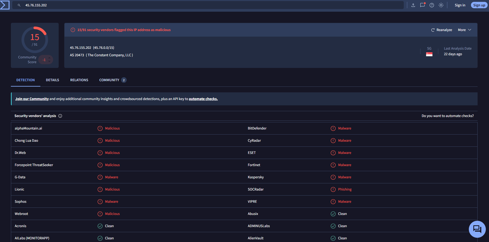

As we can see there are 15 malicious detections

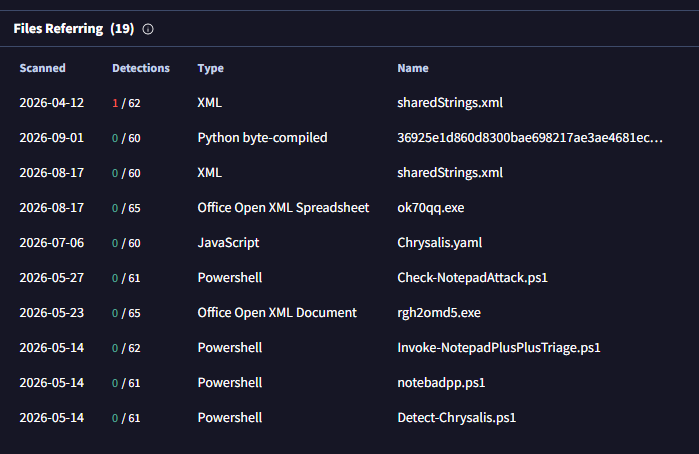

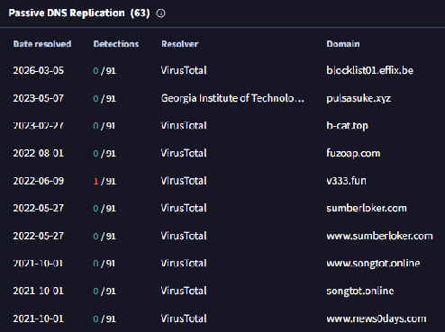

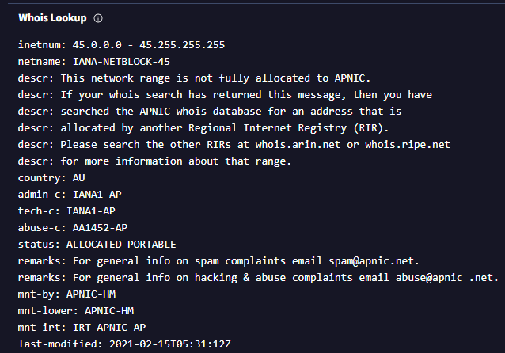

## **Maltego**

Maltego was studied as a tool for investigating relationships between different entities.

It can be used to work with information such as DNS information and other related entities.

Maltego is useful when we need to look at several pieces of information together instead of checking each indicator separately.

**Maltego investigation**

*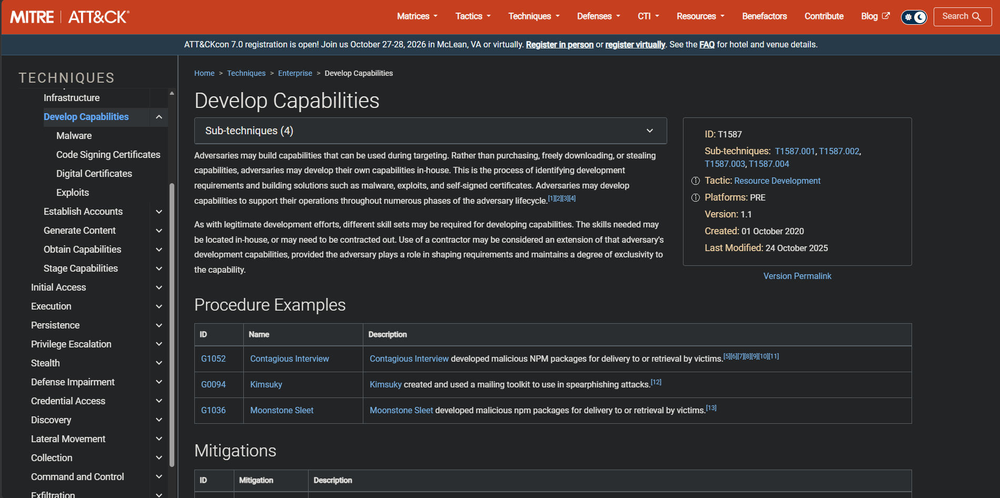*

The collected relationships can help us understand whether different indicators may be connected.

## **Shodan**

Shodan was used to examine information about Internet-connected systems and services.

The information available through Shodan can include:

* Open ports;  
* Running services;  
* OpenSSH  
* Domains  
* Countries/Cities

This type of information can help us understand the infrastructure related to an IP address.

**Shodan search results:**

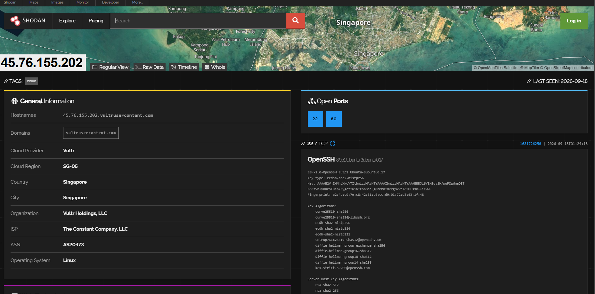

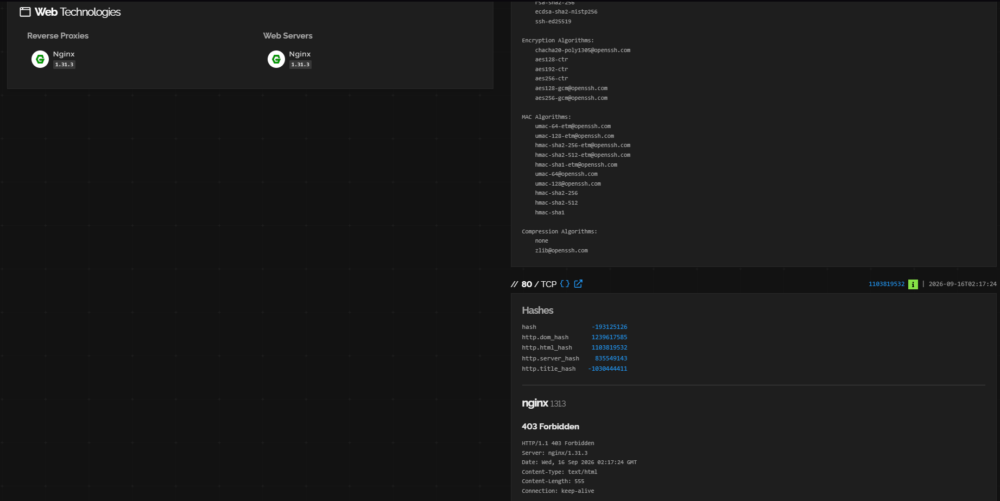

The information collected from Shodan can later be compared with other threat intelligence data during further analysis.

**Week 2 Results**

| Source | What we collect | How it can help |
| :---: | ----- | ----- |
|  VirusTotal | `IP: 45.76.155.202Domain: v333.funHash: 3efeb74673044e7da79ca37d6e2935fc9b89a55dDetections: alphaMointain.ai, ESET, Dr.Web and etc.Community Score: -1` | Additional context for suspicious indicators |
| Shodan | `Open ports: 22, 80 Domain: vultrusercontent.com ASN: AS20473 Services on port 22: SSH SSH Software: OpenSSH8.9p1 Service on port 80: HTTP Web Service: nginx 1.31.3 HTTP Responce: 403 Forbidden` | Information about exposed services |
| Maltego | Relationships between entities | Finding connections between indicators |

## **Week 3 \- Data processing and exploitation**

**MISP** 

Open source platform—originally known as the Malware Information Sharing Platform—used to collect, store, correlate, and share cyber security indicators, threats, and vulnerabilities among organizations.

**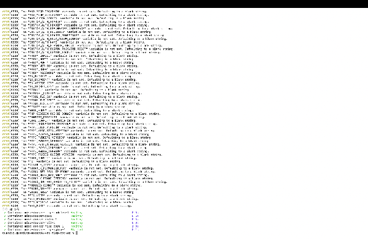**  
**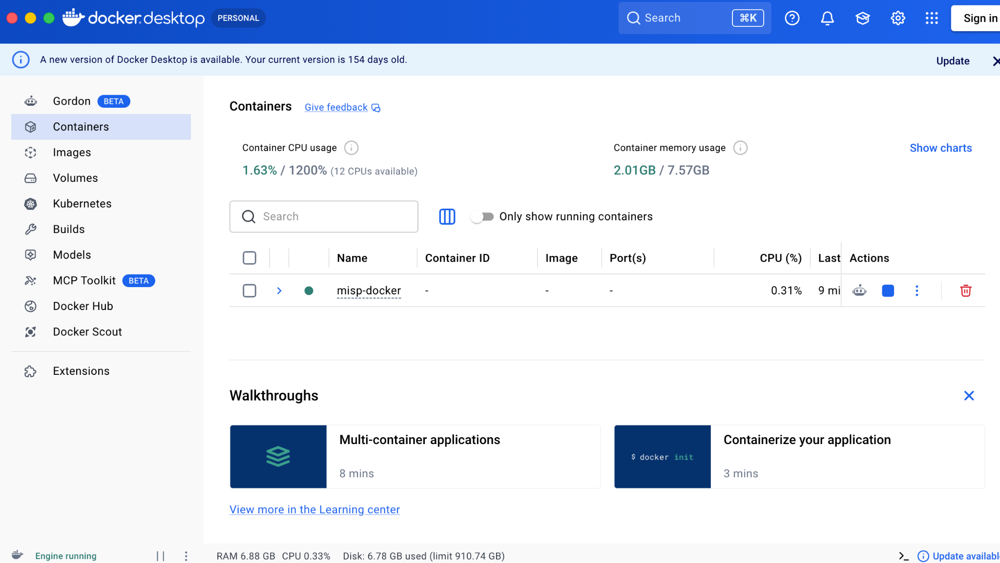**  
Installing MISP on our computer inside Docker Compose to eliminate dependency hell.

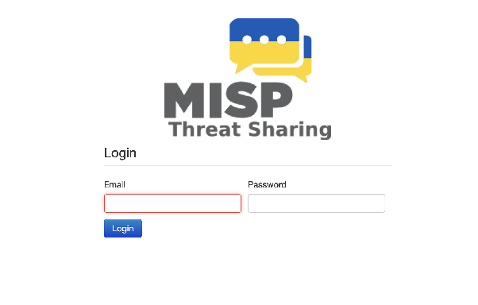  
After our installation is successful, we need to go to the [http://localhost/](http://localhost/) on our web browser and we will be greeted by MISP.

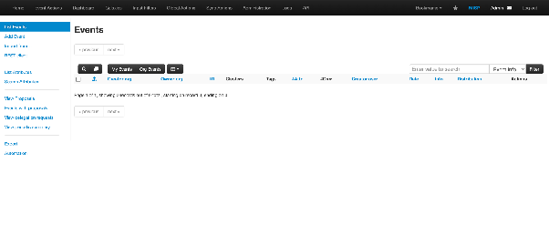

#### **Step 2 — Creating an Event**

We created a new MISP event called **“Low-Severity Threat IOC Analysis”**.

The event was configured with the following parameters:

* Threat Level: Medium  
* Analysis: Initial  
* Distribution: Your organisation only

This event was used to store the indicators collected during our analysis.

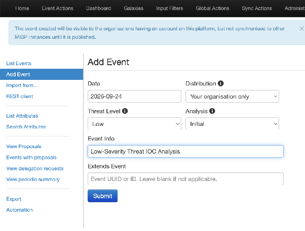

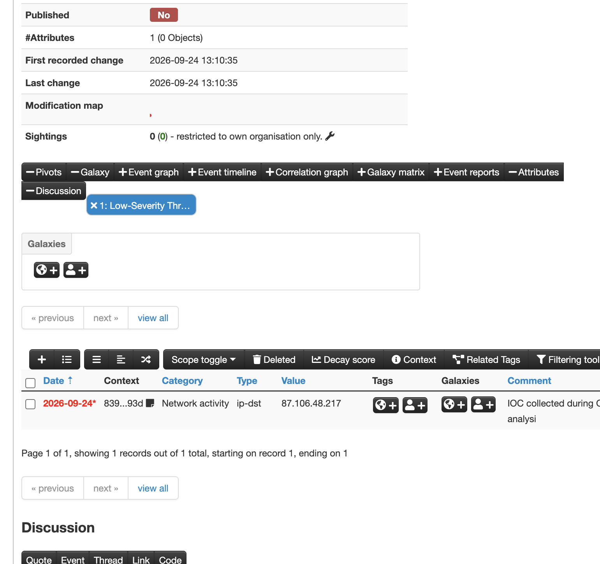

### **Step 3 — Adding and Organizing IOCs**

The collected IOCs were added to the MISP event as attributes. We used several types of indicators:

* IP address (`ip-dst`)  
* Domain (`domain`)  
* File hash (`sha256`)

For example, the IP address `87.106.48.217`, which was investigated during OSINT analysis, was added as a Network Activity attribute.

Each IOC was stored according to its type and category. This helped us organize the collected data in a structured format and prepare it for further filtering and normalization.

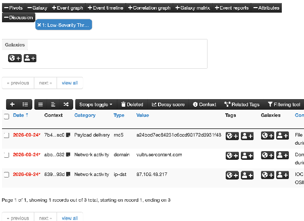

#### **Result**

As a result, we successfully deployed MISP, created an event, and imported the collected IOCs. The indicators were organized by their type and category and prepared for further filtering and normalization.

**Filtering and Normalization** 

The data was converted into .csv file for further actions.

### **Filtering and Normalization**

Filtering and normalization were applied to improve the quality and consistency of the collected IOC data.

| Technique | Raw Data Example | Process | Result |
| ----- | ----- | ----- | ----- |
| Duplicate Filtering | `87.106.48.217` appears twice | Remove duplicate values | `87.106.48.217` appears once |
| Invalid IP Filtering | `999.999.999.999` | Check if the IP address is valid | Invalid IP is removed |
| Empty Value Filtering | Empty domain value | Check for missing values | Empty row is removed |
| Domain Normalization | `Example-Domain.COM` | Convert domain to lowercase | `example-domain.com` |
| Hash Normalization | `ABCDEF123...` | Convert SHA-256 hash to lowercase | `abcdef123...` |
| Whitespace Normalization | `87.106.48.217` | Remove extra spaces | `87.106.48.217` |

After filtering and normalization, the dataset contains only valid and unique IOCs in a consistent format. The processed data can then be used for further threat intelligence analysis.

---

## **Use of AI Tools**

ChatGPT was used during the preparation of this project for:
- Finding publicly available IP address information for OSINT analysis.
- Polishing and improving the wording and readability of the report text.

The analysis, investigation steps, and project results were reviewed and performed by the project team.
